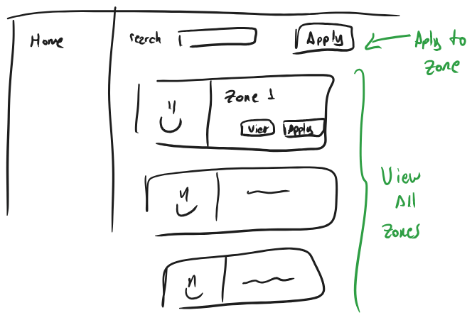
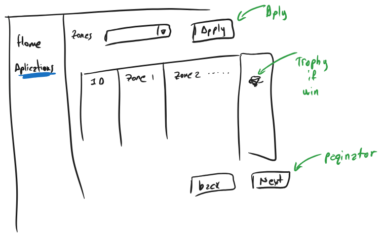
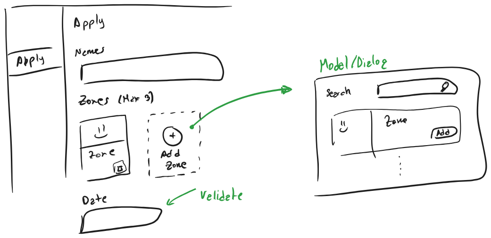
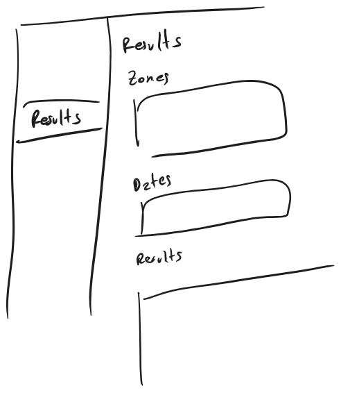

# Kilo

## 🛠 Requirements

- [Node.js](https://nodejs.org/en/download)
- [pnpm](https://pnpm.io/installation#using-corepack)
- PostgreSQL (running locally, via Docker, or an external service)

## Wireframes

### Home

### Applications

### Apply form

### Results

